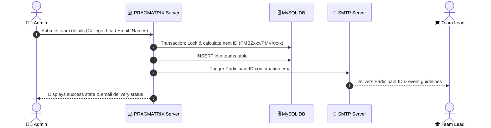
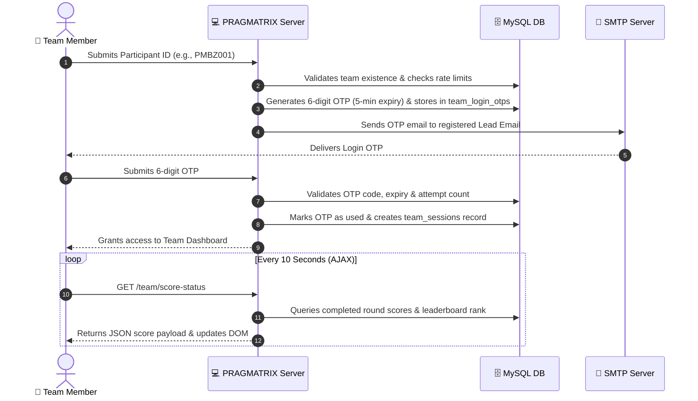

# 🏛️ PRAGMATRIX 2026
### *Applied Management Carnival — Inter-Collegiate Fest*
Organized by the **Post Graduate Department of Business Administration, Seshadripuram College, Bengaluru**

---

## 📌 Overview

**PRAGMATRIX 2026** is an enterprise-grade, high-performance web application designed to manage, score, track, and broadcast live standings for the inter-collegiate carnival. The platform caters to two premier flagship quiz events:
* **BizWizX** — The ultimate business acumen and strategic decision challenge (customizable 4-round tournament).
* **Vortex** — A curated applied management gauntlet across 4 fixed rounds: **KAIROS**, **THEORAI**, **ENMA**, and **SLANCIO**.

The application provides an **Admin Command Center** for team onboarding, round management, score submissions, and scorecard generation, along with a secure **OTP-based Participant Dashboard** delivering near real-time live score updates.

---

## ✨ Key Features

### 🔐 1. Admin-Only Team Registration & Onboarding
* **Restricted Access:** Self-service public registration is disabled; only authenticated admins can create and manage teams.
* **Participant Identification:** Automatically generates sequential, collision-free unique IDs per event:
  * `PMBZ001`, `PMBZ002`, ... for **BizWizX**
  * `PMVX001`, `PMVX002`, ... for **Vortex**
* **Instant Email Notification:** Upon team creation, the system immediately dispatches a formal registration confirmation email containing the assigned Participant ID, event schedule, and venue details to the Team Lead's email.
* **Manual Email Dispatch:** Admins can resend credentials with a single click from the team registry.

### 🔑 2. OTP-Secured Participant Dashboard
* **Two-Step Passwordless Authentication:**
  1. Team enters their unique Participant ID (`PMBZxxx` / `PMVXxxx`).
  2. System issues a cryptographically secure (`SecureRandom`) 6-digit numeric One-Time Password (OTP) sent directly to the registered Team Lead's email.
  3. Team enters the OTP to establish an authenticated session.
* **Security & Rate Limiting:**
  * 5-minute OTP expiry window.
  * Maximum 5 wrong attempts before OTP lockout.
  * Anti-spam throttle: max 1 resend per 60 seconds and max 5 OTP requests per 15 minutes.
  * Server-side session tracking in database and `HttpSession`.

### 📊 3. Real-Time Live Team Dashboard
* **Instant Score Tracking:** Logged-in teams view their round-wise status, judging criteria, individual round points, total accumulated points, and current ranking.
* **Seamless Concurrent Updates (No Refresh Needed):** Employs asynchronous background AJAX polling (every 10s) to reflect score updates and round status changes made by admins on the fly.
* **Interactive UI:** Dynamic "Last updated" status indicators and visual state alerts for active vs. completed rounds.

### ⚖️ 4. Admin Management Hub
* **Multi-Admin Support:** Seeded with 10 individual admin accounts (`admin1` through `admin10`) with bcrypt-hashed passwords.
* **Round Administration:** Edit round names (for BizWizX) and judging criteria; finish/lock rounds to compute leaderboard points or reopen rounds for audits.
* **Batch Score Entry:** Transactional score entry grid with automated input sanitization and duplicate key updates.
* **Live Leaderboard & Printable Scorecards:** Instant calculation of standings with dedicated, clean, printable scorecard generation tailored for event archives.

---

## 🛠️ Technology Stack

| Layer | Technologies / Libraries | Purpose |
| :--- | :--- | :--- |
| **Backend Runtime** | **Java 17 (LTS)** | Core application logic and execution |
| **Servlet Specification**| **Jakarta Servlet API 5.0 (Jakarta EE 9+)** | Web controllers, filters, and routing |
| **Presentation Tier** | **Jakarta Server Pages (JSP) 3.0, JSTL 3.0** | Server-side templating and views |
| **Database** | **MySQL 8.0+** | Relational data persistence & transactional locking |
| **Connection Pooling**| **HikariCP 5.1.0** | High-performance, low-latency JDBC pool |
| **Security & Auth** | **jBCrypt 0.4, Java SecureRandom** | Password hashing & OTP token generation |
| **Mailing Service** | **Jakarta Mail 2.1.3 + Eclipse Angus Mail 2.0.3** | Automated SMTP email delivery |
| **JSON Serialization**| **Google Gson 2.10.1** | Live score status AJAX endpoints |
| **Styling & Theme** | **Vanilla CSS3 (Custom Royal Design Tokens)** | Gold, purple, and ivory glassmorphism theme |
| **Build Tool** | **Apache Maven 3.8+** | Dependency management & WAR packaging |
| **Target Server** | **Apache Tomcat 10.1+ / Eclipse Jetty 11+** | Servlet container runtime |

---

## 🔄 System Architecture & Workflows

### 1. Team Onboarding & Registration Workflow


### 2. OTP-Secured Participant Login & Live Updates


---

## 📁 Project Directory Structure

```
PRAGMATRIX/
├── sql/
│   ├── schema.sql                       # Full database schema and indexes
│   ├── seed.sql                         # Quiz master data & default seed rounds
│   └── migrate_v2.sql                   # Incremental migration (lead_email, OTP & sessions)
├── src/
│   └── main/
│       ├── java/com/pragmatrix/
│       │   ├── dao/                     # Data Access Objects (JDBC + PreparedStatements)
│       │   │   ├── AdminDAO.java
│       │   │   ├── OtpDAO.java          # OTP generation, rate limiting & verification
│       │   │   ├── QuizDAO.java
│       │   │   ├── RoundDAO.java
│       │   │   ├── ScoreDAO.java        # Batch score upserts & leaderboard views
│       │   │   ├── TeamDAO.java         # Transaction-locked ID generation & queries
│       │   │   └── TeamSessionDAO.java  # Persistent team session management
│       │   ├── filter/                  # Route guards and authentication filters
│       │   │   ├── AdminAuthFilter.java # Protects /admin/* routes
│       │   │   └── TeamAuthFilter.java  # Protects /team/* routes
│       │   ├── listener/
│       │   │   └── AppContextListener.java # Pool initialization & admin seeding
│       │   ├── model/                   # POJO Data Models
│       │   │   ├── Admin.java
│       │   │   ├── LeaderboardEntry.java
│       │   │   ├── Quiz.java
│       │   │   ├── Round.java
│       │   │   ├── Score.java
│       │   │   ├── Team.java
│       │   │   ├── TeamLoginOtp.java
│       │   │   └── TeamSession.java
│       │   ├── servlet/                 # HTTP Request Handlers
│       │   │   ├── AdminLoginServlet.java
│       │   │   ├── AdminLogoutServlet.java
│       │   │   ├── DashboardServlet.java
│       │   │   ├── FinishRoundServlet.java
│       │   │   ├── LeaderboardServlet.java
│       │   │   ├── RegisterServlet.java # Admin-only team onboarding
│       │   │   ├── RegistrationSuccessServlet.java
│       │   │   ├── ResendIdEmailServlet.java
│       │   │   ├── RoundManageServlet.java
│       │   │   ├── ScorecardServlet.java
│       │   │   ├── ScoreEntryServlet.java
│       │   │   ├── TeamDashboardServlet.java
│       │   │   ├── TeamLoginServlet.java
│       │   │   ├── TeamLogoutServlet.java
│       │   │   ├── TeamOtpVerifyServlet.java
│       │   │   ├── TeamScoreStatusServlet.java # Polling JSON endpoint
│       │   │   └── TeamSearchServlet.java
│       │   └── util/                    # Helper Utilities
│       │       ├── DBConnection.java    # HikariCP DataSource manager
│       │       ├── EmailService.java    # Jakarta Mail SMTP integration
│       │       ├── IdGenerator.java     # Synchronized ID sequencer
│       │       ├── OtpUtil.java         # Crypto OTP generator & email masker
│       │       └── PasswordUtil.java    # BCrypt password hasher
│       ├── resources/
│       │   ├── db.properties            # MySQL connection & pool parameters
│       │   ├── email.properties         # SMTP credentials (Git-ignored)
│       │   └── email.properties.template# Sample SMTP template
│       └── webapp/
│           ├── css/
│           │   ├── print.css            # Styles for printable scorecard sheets
│           │   ├── style.css
│           │   └── theme.css            # Royal gold/purple glassmorphic design system
│           ├── images/                  # Event branding, badges & assets
│           ├── WEB-INF/
│           │   ├── views/               # Protected JSP views
│           │   │   ├── dashboard.jsp    # Admin hub with embedded Add Team section
│           │   │   ├── error.jsp
│           │   │   ├── leaderboard.jsp
│           │   │   ├── score-entry.jsp
│           │   │   ├── scorecard.jsp
│           │   │   └── team-dashboard.jsp # Live participant view
│           │   └── web.xml              # Web deployment descriptor
│           ├── admin-login.jsp          # Admin sign-in page
│           ├── index.jsp                # Landing portal
│           ├── team-login.jsp           # Participant ID submission page
│           └── team-otp-verify.jsp      # OTP verification page
├── pom.xml                              # Maven build specifications
└── README.md
```

---

## 🗃️ Database Schema

```
                           +----------------------+
                           |       quizzes        |
                           +----------------------+
                           | quiz_code (PK)       |
                           | quiz_name            |
                           | id_prefix            |
                           +----------+-----------+
                                      | 1
                                      |
                                      | N
+----------------------+   +----------+-----------+   +----------------------+
|       admins         |   |        teams         |   |        rounds        |
+----------------------+   +----------------------+   +----------------------+
| admin_id (PK)        |   | unique_id (PK)       |   | round_id (PK)        |
| username (UQ)        |   | quiz_code (FK)       |   | quiz_code (FK)       |
| password_hash        |   | college_name         |   | round_number         |
| full_name            |   | lead_email           |   | round_name           |
| created_at           |   | student1_name        |   | judging_criteria     |
+----------+-----------+   | student2_name        |   | is_finished          |
           |               | student3_name        |   | finished_at          |
           |               | registered_at        |   +----------+-----------+
           |               +----+-------------+---+              |
           |                    |             |                  |
           | 1                1 |           1 |                1 |
           |                    |             |                  |
           | N                N |           N |                N |
+----------+--------------------+---+    +----+------------------+---+
|              scores               |    |      team_login_otps      |
+-----------------------------------+    +---------------------------+
| score_id (PK)                     |    | otp_id (PK)               |
| unique_id (FK)                    |    | unique_id (FK)            |
| round_id (FK)                     |    | otp_code                  |
| points                            |    | generated_at              |
| entered_by (FK)                   |    | expires_at                |
| entered_at                        |    | is_used                   |
+-----------------------------------+    | attempt_count             |
                                         +---------------------------+
                                                      | 1
                                                      |
                                                      | N
                                         +------------+--------------+
                                         |       team_sessions       |
                                         +---------------------------+
                                         | session_id (PK)           |
                                         | unique_id (FK)            |
                                         | created_at                |
                                         | expires_at                |
                                         +---------------------------+
```

---

## 🚀 Setup & Installation Guide

### 1. Prerequisites
* **Java Development Kit (JDK):** Version 17 or higher
* **Apache Maven:** Version 3.8+
* **MySQL Server:** Version 8.0+
* **Web Server / Servlet Container:** Apache Tomcat 10.1+ (supports Jakarta EE 9/10)

---

### 2. Database Initialization
1. Log in to your MySQL terminal or GUI client (Workbench, DBeaver):
   ```bash
   mysql -u root -p
   ```
2. Execute the base schema and seed scripts:
   ```sql
   SOURCE sql/schema.sql;
   SOURCE sql/seed.sql;
   ```
3. *(If updating an existing installation)*, run the migration script:
   ```sql
   SOURCE sql/migrate_v2.sql;
   ```

---

### 3. Application Configuration

#### A. Database Connection (`src/main/resources/db.properties`)
Update the connection string and credentials to match your MySQL environment:
```properties
db.url=jdbc:mysql://localhost:3306/pragmatrix2026?useSSL=false&allowPublicKeyRetrieval=true&serverTimezone=UTC&characterEncoding=UTF-8
db.username=root
db.password=YourMySQLPassword
db.pool.maxSize=15
db.pool.minIdle=5
```

#### B. SMTP Mail Settings (`src/main/resources/email.properties`)
Configure your SMTP mail credentials to enable automated Participant ID confirmation and Login OTP emails. For Gmail:
1. Enable **2-Step Verification** on your Google Account.
2. Generate an **App Password** under *Security > 2-Step Verification > App passwords* (Select "Mail" / "Other").
3. Populate `src/main/resources/email.properties`:
```properties
email.smtp.host=smtp.gmail.com
email.smtp.port=587
email.smtp.username=your-institution-email@gmail.com
email.smtp.password=abcd efgh ijkl mnop
email.from.address=your-institution-email@gmail.com
email.from.name=PRAGMATRIX 2026
```

---

### 4. Build & Deployment

#### Option A: Build Deployable WAR
Execute Maven from the repository root:
```bash
mvn clean package
```
* The packaged WAR file will be generated at: `target/pragmatrix2026.war`
* Copy `pragmatrix2026.war` into your Tomcat `webapps/` directory and start Tomcat:
  * **Windows:** `catalina.bat start`
  * **Linux/macOS:** `./catalina.sh start`
* Access the web application at: `http://localhost:8080/pragmatrix2026`

---

## 👥 Default Credentials

### Admin Accounts
The system automatically provisions 10 administrative accounts on startup if not already present:

| Username | Default Password | Role |
| :--- | :--- | :--- |
| `admin1` | `Pragmatrix@2026` | Quiz Administrator |
| `admin2` | `Pragmatrix@2026` | Quiz Administrator |
| `admin3` to `admin10` | `Pragmatrix@2026` | Quiz Administrator |

> 🔒 **Security Notice:** Change default passwords in production via the administrative user management interface or database bcrypt update.

---

## 🛡️ Security Architecture

* **SQL Injection Prevention:** 100% of database interactions are implemented using strictly parameterized `PreparedStatement` queries.
* **Credential Protection:** Passwords are encrypted with salted BCrypt hashing.
* **OTP Hardening:** 
  * Generation relies on `java.security.SecureRandom`.
  * Single-use execution enforced by atomic state updates.
  * Invalidation of obsolete OTP tokens prior to new generation.
* **Session Integrity:** Team and Admin routes are guarded by dedicated `HttpFilter` instances (`AdminAuthFilter` and `TeamAuthFilter`) preventing unauthorized endpoint bypass.

---

## 📜 License
PRAGMATRIX 2026 is published under the terms of the project's standard [LICENSE](LICENSE).

---
*Created for the Post Graduate Department of Business Administration, Seshadripuram College, Bengaluru.*